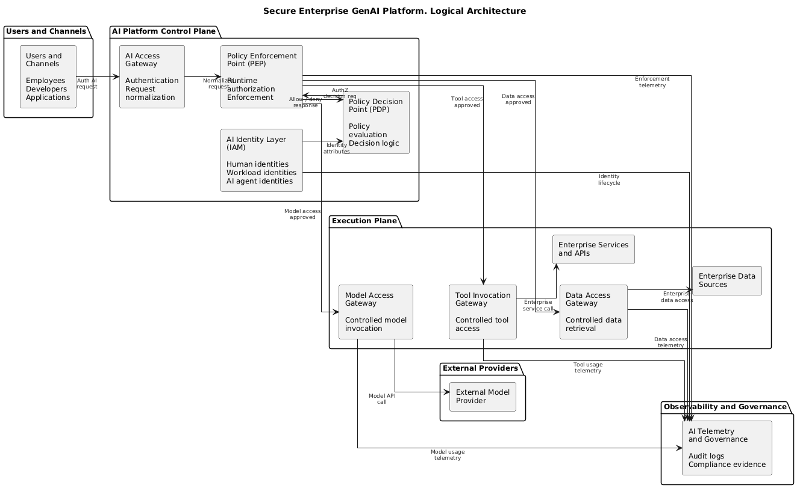

# Secure Enterprise Generative AI Platform

## Objective

Define a reference architecture for deploying generative AI within a financial institution
while preserving accountability, least privilege, regulatory compliance, and auditability.

## Architectural Principles

- AI systems are treated as security principals
- All access is explicitly authorized at runtime
- Policy enforcement is centralized and auditable
- AI governance integrates with existing IAM and GRC processes

## Architecture Overview

## Key Components

- AI Identity Layer
- Policy Enforcement Point
- Model Access Gateway
- Tool and Data Access Mediation
- Observability and Audit Layer
- Governance Integratio

## Component Explanations (Logical Architecture)

### Users and Channels
Entry points for interacting with AI. This includes employees using chat interfaces, developers calling APIs, and applications embedding AI into workflows. This is the origin of user intent and where accountability must begin.

### AI Access Gateway
The controlled ingress for all AI requests. It centralizes intake, normalizes request formats, and applies baseline protections (authentication handling, request shaping, throttling). Its primary purpose is to eliminate uncontrolled direct access paths to AI capabilities.

### Policy Enforcement Point (PEP)
The enforcement chokepoint for the platform. It gates every model call, tool call, and retrieval action. It requests authorization decisions from the PDP, applies the returned constraints at runtime, and ensures no protected action occurs without enforceable controls.

### Policy Decision Point (PDP) and Policy Store
The authorization decision engine and its governed policy repository. The PDP evaluates requests using policy and context and returns explicit allow or deny decisions plus constraints (for example. approved models, permitted tools, retrieval scope, token limits, redaction requirements, logging requirements). Policies are centrally managed, versioned, and approved through governance processes.

### AI Identity Layer (IAM Integration)
The identity system of record for humans, workloads, and AI agents. It provides authentication outcomes, identity claims, and entitlements used by the PDP. It also supports lifecycle controls such as provisioning, credential rotation, suspension, and decommissioning for AI agent identities and service identities.

### Model Access Gateway
A controlled mediation layer for model invocation. It standardizes how models are called (internal hosting or external APIs), applies constraints received from the PEP, and ensures consistent telemetry regardless of model provider.

### Tool Invocation Gateway
A controlled mediation layer for agent tool use. It prevents agents from calling enterprise APIs directly. It enforces tool allowlisting, scoped permissions, transactional limits, and approval patterns for sensitive actions. It also captures complete audit records of tool usage and outcomes.

### Data Access Gateway
A controlled mediation layer for retrieval and data access, including RAG. It enforces data minimization, classification-aware access, and policy-driven constraints on what data may be retrieved and used in prompts, including redaction and filtering requirements.

### Enterprise Services and APIs
Downstream business systems and operational services invoked by tools (for example. workflow engines, ticketing, customer systems, internal platforms). These remain protected behind the Tool Invocation Gateway to preserve least privilege and auditable execution.

### Enterprise Data Sources
Internal repositories containing sensitive and regulated information (for example. customer data, operational data, knowledge bases, document stores). These remain protected behind the Data Access Gateway to ensure classification-aware access, minimization, and evidentiary logging.

### AI Telemetry and Governance
The evidence layer. It collects structured logs for authorization decisions, enforcement actions, retrieval events, tool invocations, and model usage. It feeds SIEM, audit, and compliance reporting and supports governance workflows such as onboarding, control testing, and risk assessment.

### External Model Provider
Any third-party hosted model endpoint. It is outside the institution’s trust boundary and must be accessed only through the Model Access Gateway with enforced constraints and complete telemetry for each invocation.

## Component Explanations (Runtime Request Flow)

Runtime Request Flow Diagram illustrates a single end-to-end AI request as it moves through the platform, including identity resolution, authorization, controlled retrieval and tool execution, model invocation, and evidence generation. The focus is on enforceable control and accountability at runtime.

### User or Calling Application
The origin of the AI request. This may be a human user interacting through a chat interface or an application invoking AI programmatically. This is the source of intent and must always be bound to a verifiable identity and context to preserve accountability.

### AI Access Gateway
The entry point for all AI requests. It receives the request, normalizes it into a standard internal format, and forwards it into the controlled AI platform. Its purpose is to ensure all AI interactions enter through a single, inspectable, and governable path.

### Policy Enforcement Point (PEP)
The runtime enforcement orchestrator. The PEP requests authorization decisions, applies returned constraints, and ensures that no model invocation, tool execution, or data retrieval occurs without explicit authorization. It is responsible for enforcing least privilege at execution time and for generating enforcement evidence.

### AI Identity Layer (IAM)
The system of record for identities involved in the request. It resolves human, workload, or AI agent identities and returns claims and attributes used in authorization decisions. At runtime, it ensures decisions are made based on verified identity and current lifecycle state rather than shared or implicit credentials.

### Policy Decision Point (PDP)
The authorization engine. It evaluates the requested intent against policy and context and returns an explicit allow or deny decision plus constraints. Constraints may include approved models, permitted tools, data scope, token limits, redaction requirements, and logging obligations. The PDP does not execute actions. It only decides.

### Data Access Gateway
The controlled mediation point for retrieval and data access, including retrieval-augmented generation (RAG). When retrieval is required, it validates policy decisions, enforces data minimization and classification-aware access, retrieves only permitted data, and returns filtered context to the PEP.

### Enterprise Data Sources
Internal repositories containing regulated and sensitive information. These systems are never accessed directly by AI components. All access is mediated through the Data Access Gateway to ensure enforceability, minimization, and auditability.

### Tool Invocation Gateway
The controlled mediation point for AI tool use. When a request requires an external action, this gateway validates authorization, enforces scope and transactional limits, executes the approved service call, and returns results to the PEP. It prevents AI agents from becoming ungoverned automation.

### Enterprise Services and APIs
Downstream operational systems and services invoked by tools. These remain protected behind the Tool Invocation Gateway to preserve least privilege, separation of duties, and full auditability of actions initiated by AI systems.

### Model Access Gateway
The controlled interface for model invocation. It applies policy constraints to prompts and context, standardizes model calls, and abstracts internal or external model providers. It ensures consistent control and telemetry regardless of where the model is hosted.

### External Model Provider
A third-party hosted model endpoint operating outside the institution’s trust boundary. All access is mediated by the Model Access Gateway, and every invocation is logged with sufficient metadata to support audit and risk review.

### AI Telemetry and Governance
The evidence and assurance layer. It collects structured logs and events for authorization decisions, enforcement actions, data retrieval, tool execution, model usage, and identity lifecycle events. This data supports incident response, audit reviews, regulatory examinations, and ongoing risk governance.

## Why This Matters

This architecture addresses structural control gaps that emerge when AI systems
operate outside traditional application and identity governance models.
